# 用户登录系统流程图

## 一、用户注册流程

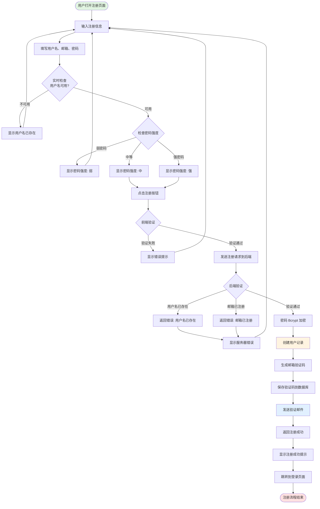

---

## 二、用户登录流程

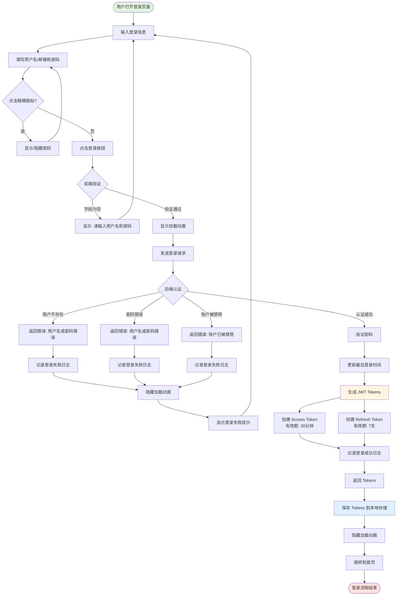

---

## 三、Token 验证和刷新流程

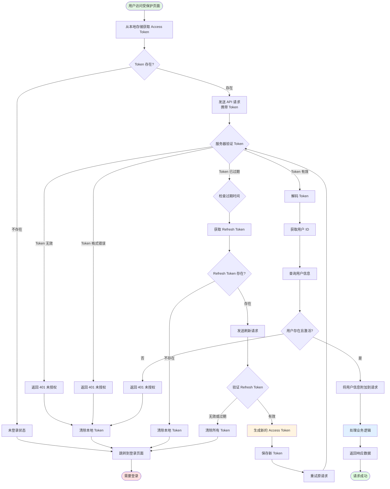

---

## 四、忘记密码流程

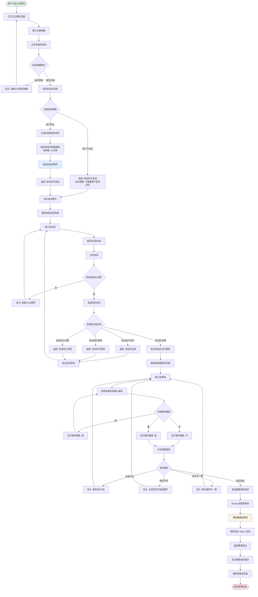

---

## 五、邮箱验证流程

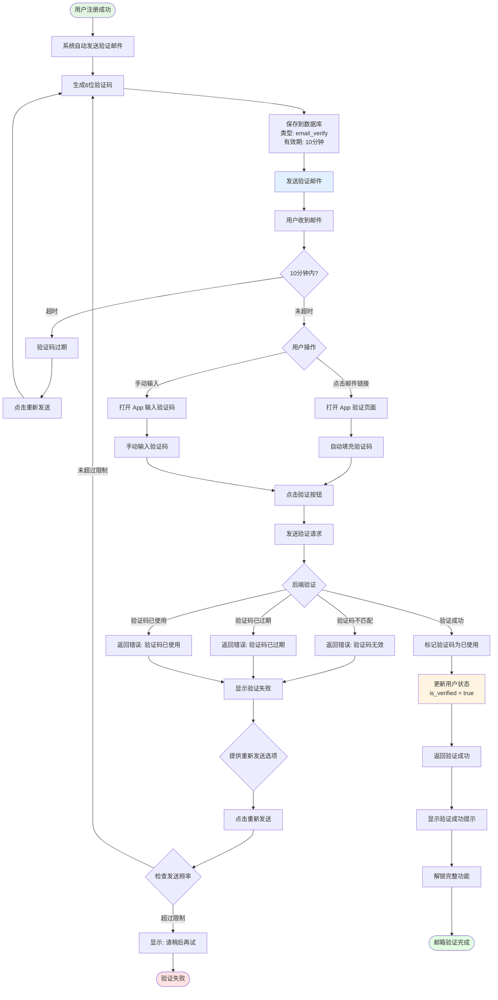

---

## 六、修改密码流程（已登录）

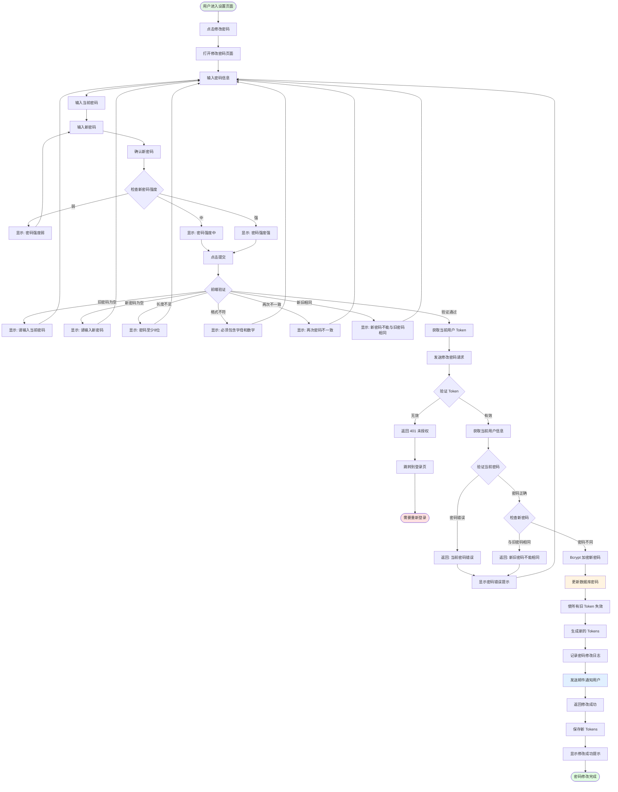

---

## 七、登出流程

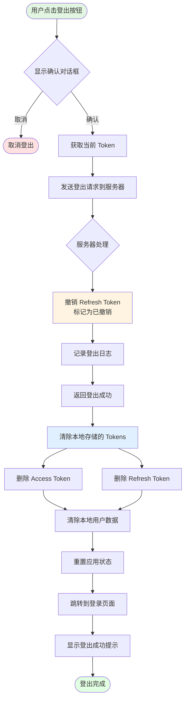

---

## 八、自动登录流程

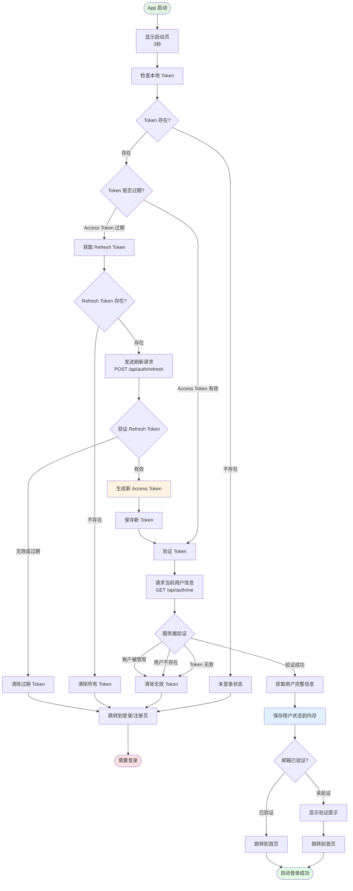

---

## 九、完整认证架构流程

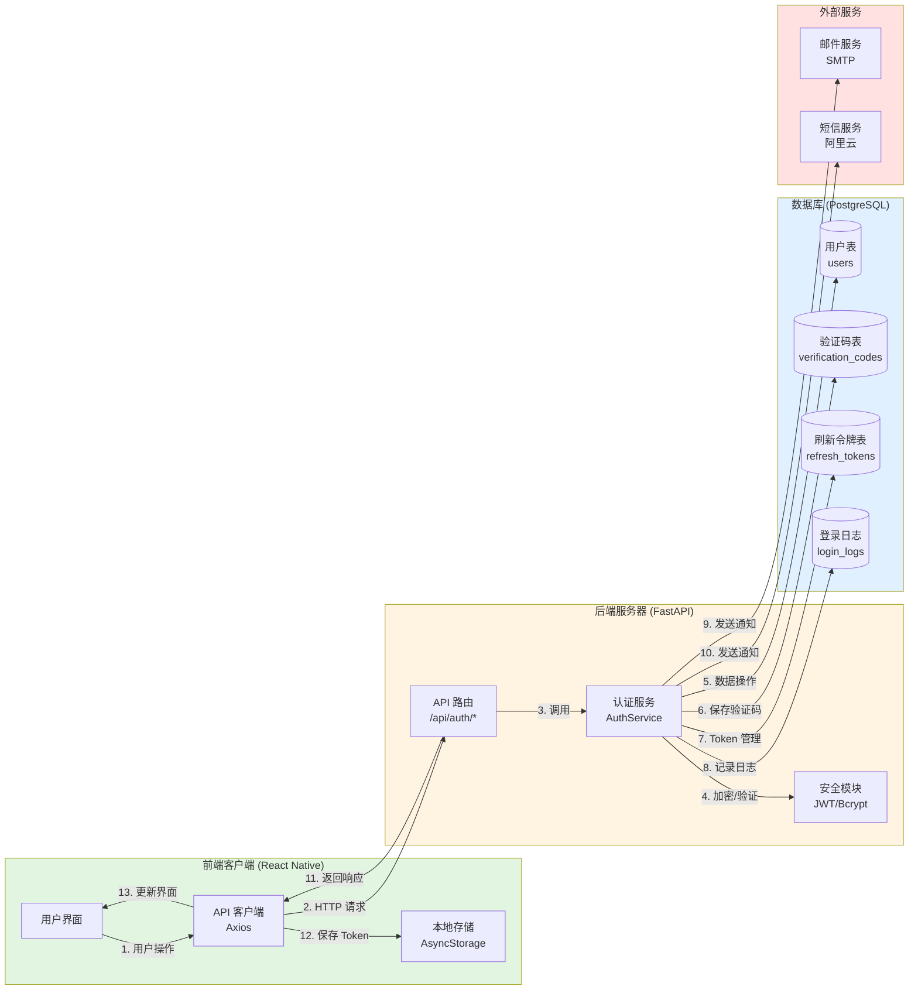

---

## 十、数据流向图

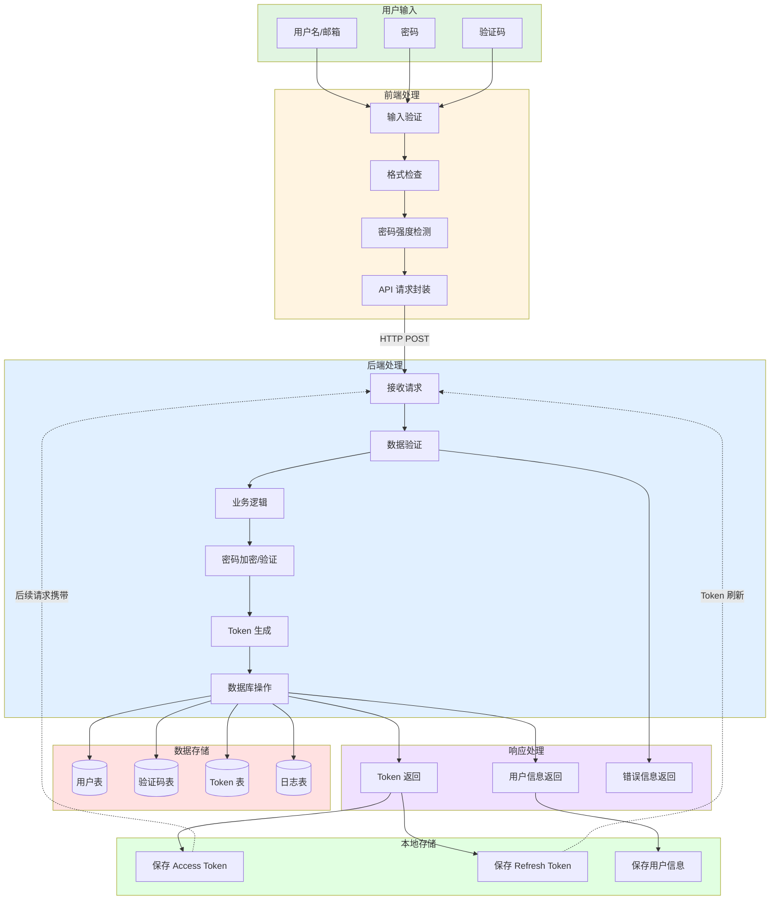

---

## 十一、Token 生命周期图

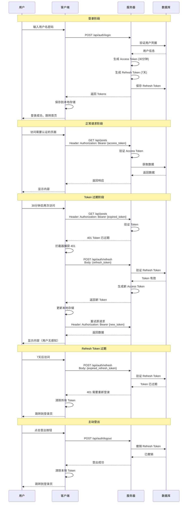

---

## 十二、安全防护流程

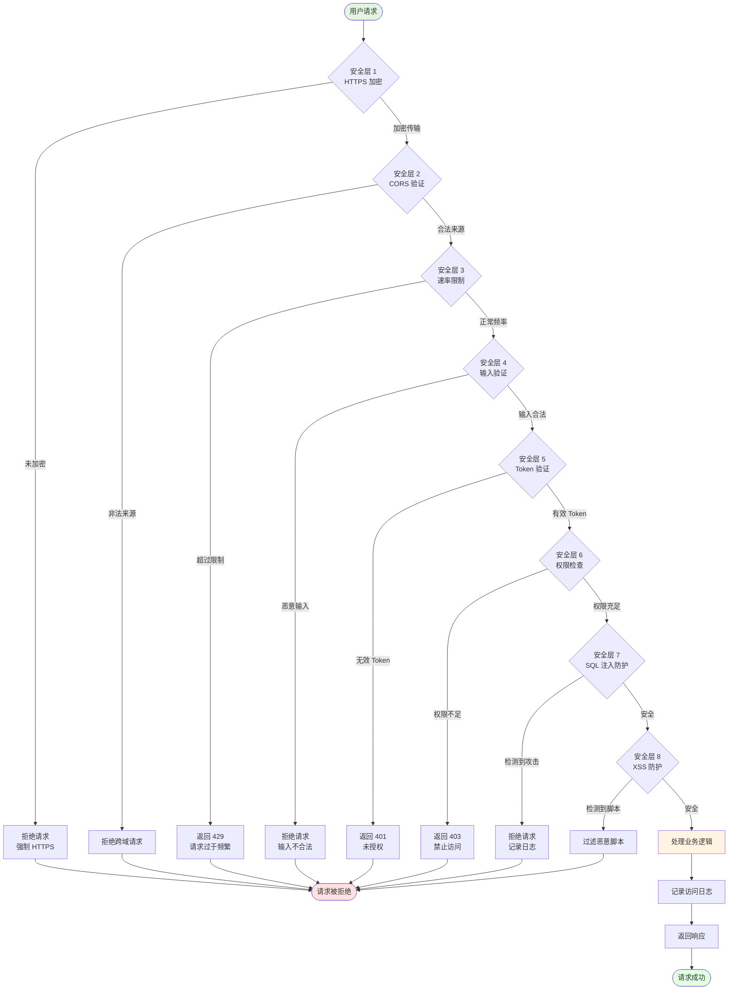

---

## 使用说明

### 如何查看流程图

这些流程图使用 **Mermaid** 语法编写，支持在以下环境中查看：

1. **GitHub/GitLab**
   - 直接在仓库中查看 Markdown 文件，流程图会自动渲染

2. **VS Code**
   - 安装 "Markdown Preview Mermaid Support" 插件
   - 预览 Markdown 文件即可看到流程图

3. **在线工具**
   - [Mermaid Live Editor](https://mermaid.live/)
   - 复制流程图代码到编辑器中查看

4. **Notion / Confluence**
   - 支持 Mermaid 图表的知识库平台

### 流程图说明

- 🟢 **绿色节点**：流程起点
- 🔴 **红色节点**：流程终点（失败/错误）
- 🟡 **黄色节点**：关键操作（数据库写入、Token 生成等）
- 🔵 **蓝色节点**：外部服务调用（邮件、短信）
- 💎 **菱形节点**：判断/分支
- 📦 **矩形节点**：处理步骤

### 对应的设计文档

详细的实现代码和 API 文档请参考：
- **用户登录系统设计文档.md** - 完整的技术实现
- **Tennis-Frog设计索引.md** - Figma 设计对照
- **技术实践路径.md** - 开发实践指南

---

**文档版本：** v1.0  
**创建日期：** 2025-11-03  
**流程图总数：** 12 个

希望这些流程图能帮助你更好地理解用户登录系统的各个环节！🎯

